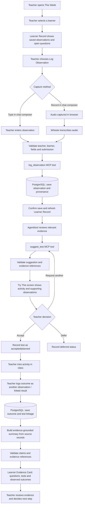
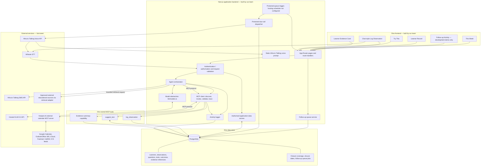
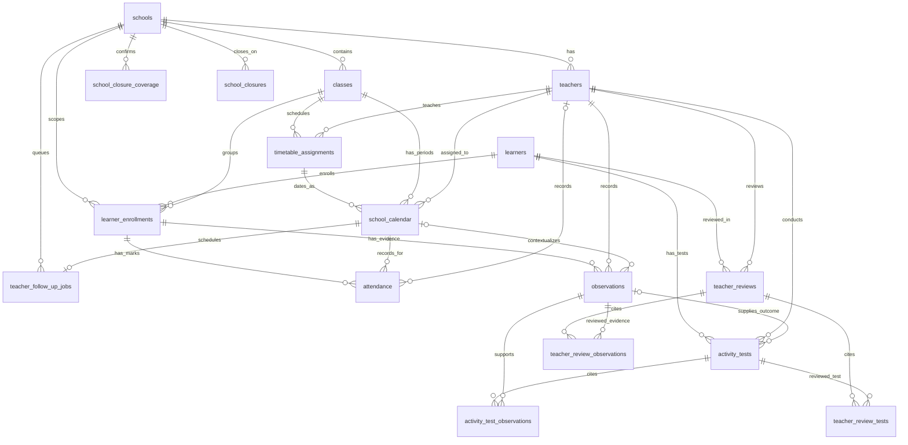

# Dira — Project Architecture

> **Status:** Revised architecture and MVP plan (9 October 2026). This document describes intended behaviour and decisions; it is not proof that every component or integration has been implemented. External integrations must be tested before being described as working.
>
> **Audience:** The Dira team, including developers who are new to Next.js.
>
> **MVP boundary:** Teacher-facing workflow only. Dira captures observations, helps teachers explore questions through small classroom tests, and presents an evidence-grounded Learner Evidence Card. The MVP does **not** assign a learner a fixed pathway, require a pathway-note approval step, or send a card to a guardian.

## 1. Project overview

Dira supports teachers in collecting and reviewing evidence about learners over time. It is designed for real classroom conditions, including busy teachers and large classes. It helps teachers decide what small activity to try next; it does not decide who a learner is or prescribe a future for them.

### Core product principles

- **Evidence before conclusions:** factual claims should be traceable to actual observation and test records.
- **Teacher decides:** the agent suggests; the teacher decides whether to try an activity and how to interpret the evidence.
- **No fixed learner labels or pathway assignment:** Dira must not classify, rank, diagnose, or assign a learner a career/pathway.
- **Preserve uncertainty:** contradictory or insufficient evidence must be visible rather than hidden.
- **One teacher workflow for the MVP:** no guardian delivery workflow or guardian-facing approval step.
- **Do not claim unimplemented work:** this architecture describes intended responsibilities. Actual implementation and provider availability must be verified during development.

## 2. Technology stack and integrations

| Area | Selected technology / service | Responsibility | Ownership / status |
|---|---|---|---|
| Web application | Next.js App Router + React + TypeScript | Pages, layouts, UI, and server-side application routes | Dira code; repository structure exists |
| Styling | Global CSS and reusable UI components | Responsive desktop/mobile presentation and shared visual language | Dira code |
| Model | GLM-5.3 through a hosted API | Reason over relevant context and propose appropriate next actions | External hosted model; provider and API configuration must be confirmed |
| Model abstraction | `lib/models.ts` | Keep provider/model configuration replaceable and server-side | Dira code |
| Agent orchestration | `lib/agent/orchestrator.ts` | Decide which agent action to run and coordinate the workflow | Dira code |
| MCP client | `lib/agent/mcp-client.ts` | Streamable HTTP transport through the official MCP SDK, OAuth-provider injection, tool discovery/invocation, request timeouts, and error propagation | Client foundation implemented; secure OAuth session/token persistence and live Keeper verification remain |
| Dira MCP tool: observation | `lib/mcp-tools/logObservation.ts` | Validate and persist a teacher observation through the approved tool workflow | Dira-owned tool |
| Dira MCP tool: test suggestion | `lib/mcp-tools/suggestTest.ts` | Propose a small, practical classroom test grounded in learner evidence | Dira-owned tool |
| Evidence summary | `lib/mcp-tools/draftPathwayNote.ts` (existing filename) | Build the evidence-grounded content used by the Learner Evidence Card; must not assign a pathway or produce a learner verdict | Dira-owned capability; filename is legacy and can be renamed later |
| Database | PostgreSQL | System of record for learners, observations, questions/tests, outcomes, and evidence summaries/references | Dira data store; schema/client files are present in the planned structure |
| Speech-to-text | Whissle | Transcribe audio from in-app voice notes or captured telephone audio | External API; confirm account, endpoint, audio format, and limits |
| SMS | Africa's Talking SMS API | Send short teacher reminders and weekly focus messages | External API; selected provider |
| Outbound voice | Africa's Talking Voice API | Initiate a scheduled teacher follow-up; audio capture is a later phase | Server-side request adapter, demo-gated due dispatcher, and teacher-scoped development status page implemented; credentials, callbacks, teacher authentication/consent, and live calls remain unverified |
| Calendar MCP server (borrowed) | Keeper.sh MCP server — repository: https://github.com/ridafkih/keeper.sh; hosted MCP endpoint: `https://www.keeper.sh/mcp` | Give Dira one MCP interface for connected Google Calendar, Outlook/Microsoft 365, iCloud, Fastmail, CalDAV, and read-only ICS/iCal feeds | Selected; client transport and bounded read-only adapter implemented, but OAuth authorization and an authenticated tool call remain unverified |
| Calendar provider access | Calendar accounts connected through Keeper.sh | Supply lesson schedule and timing context for follow-up workflows | External calendar providers; Dira should call the borrowed server through MCP rather than label a direct provider API adapter as an MCP server |
| Educational-source retrieval | External retrieval/search adapter to approved sources (e.g. IBEF, AMI, WWC) | Quickly retrieve relevant educational guidance when generating a suggested classroom test | Required agent behaviour; exact provider/adapter must be selected and verified. No persistent source catalogue table in PostgreSQL for the MVP |
| Logging | `lib/agent/logger.ts` and `agent_activity_logs` concept | Trace runs, tool calls, status, latency, model, and errors | Dira code/data design; do not log private chain-of-thought |
| Validation | `lib/validators/` | Validate request shape, ownership, IDs, and safety constraints | Dira code |
| Synthetic data | `scripts/clean_dataset.py`, `scripts/generate_synthetic_data.py` | Prepare synthetic development/evaluation data | Repository scripts |
| Testing/evaluation | `EVALS.md` | Document behavioral, safety, and integration evaluations | Project documentation |

### Keeper.sh integration decision and verification checklist

1. Use Keeper.sh as the borrowed external calendar MCP server; do not replace this with a direct Google Calendar REST integration and call it MCP.
2. Start with the hosted MCP endpoint documented by Keeper (`https://www.keeper.sh/mcp`). Dira's client now supports Streamable HTTP and accepts an OAuth provider; implement secure per-user OAuth callback and token persistence before claiming hosted authentication support.
3. Connect a test calendar account through Keeper.sh and request a small, date-bounded set of events using an actual MCP tool such as `list_calendars` or `get_events`.
4. Pass only the minimum schedule context needed by Dira. Calendar data is timing context, never evidence that a lesson or learner activity occurred.
5. Handle authentication failure, unavailable calendars, rate limits, and request timeouts. Keeper’s hosted free plan documents a combined 25 API/MCP requests per day; check current plan limits before the demo.
6. Record the external server's repository and the successful MCP call in the demo/evaluation notes. Until this test passes, describe Keeper as **selected with client foundation implemented**, not as a completed integration.

### What is ours and what is borrowed?

**Built for Dira**
- Teacher-facing pages and reusable components.
- Agent orchestration, model abstraction, MCP client, and activity logging.
- Dira's own MCP tools: `log_observation`, `suggest_test`, and the evidence-summary capability.
- Database schema, application validation, test lifecycle, and evidence-card assembly.

**External/borrowed services and MCP**
- Hosted GLM-5.3 model API.
- Whissle speech-to-text API.
- Africa's Talking SMS and Voice APIs.
- **Keeper.sh: the selected borrowed, third-party calendar MCP server** ([repository](https://github.com/ridafkih/keeper.sh), [MCP documentation](https://www.keeper.sh/docs/mcp)). Its documented providers include Google Calendar, Outlook/Microsoft 365, iCloud, Fastmail, CalDAV, and pull-only iCal/ICS feeds. It does not document a native Calendly integration, so do not claim direct Calendly support. The hosted MCP endpoint uses streamable HTTP and OAuth 2.1. The hosted free plan documents 25 API/MCP requests per day; verify this is enough for development and the demo, or deliberately evaluate self-hosting.
- An external retrieval/search adapter for educational sources, to be selected and tested. This is not assumed to be an MCP server unless we explicitly integrate a real MCP server for retrieval.

An external API is not automatically an MCP server. The borrowed-server requirement is met only when Dira actually connects to and invokes the external MCP server through the MCP protocol. For the calendar integration, the intended design is to use Keeper.sh through Dira's MCP client, not to call Google Calendar's REST API directly and describe that as borrowed MCP usage. The `lib/external-mcp/` folder in the current tree is an integration/adaptation area; its name alone does not prove that each provider is an MCP server. Keeper documents an MCP endpoint at `https://www.keeper.sh/mcp` using streamable HTTP and OAuth 2.1 for the hosted service. Dira’s client must support the required transport and authentication flow; verify this before implementation is marked complete. The hosted free plan currently documents a limit of 25 API/MCP requests per day, so estimate demo calls and confirm the plan is sufficient. If that limit or the authentication flow blocks the demo, explicitly decide whether to self-host Keeper rather than silently bypassing MCP. The Keeper integration remains planned until connection, authentication, tool calls, and returned data have been tested end to end.

### Planned versus deferred

- **Core MVP:** teacher workflow, learner record, typed and in-app voice observation capture, observation persistence, test suggestions, teacher test actions, and the Learner Evidence Card.
- **Planned communication capability:** Africa's Talking SMS and outbound voice capture are part of the intended system. If the seven-day implementation window makes every integration unrealistic, clearly label what is working versus pending.
- **Calendar-aware agentic follow-up:** use lesson schedule, learner evidence, and accepted test status to decide when a follow-up is useful. The calendar supplies context/timing; it does not prove that a lesson happened or that a learner attended.
- **Required suggestion-time behaviour:** before returning a classroom-test suggestion, the agent should make a fast, bounded attempt to retrieve relevant guidance from approved external educational sources (for example IBEF, AMI, and WWC). Use a strict configurable timeout (initially a few seconds, then tune through tests) and sensible error handling. If retrieval succeeds, use only relevant retrieved material and preserve source attribution. If retrieval times out or fails, continue using the learner's recorded evidence and the model's available knowledge, clearly indicating that external guidance could not be retrieved for this suggestion; never claim to have consulted sources that were not retrieved. The exact retrieval adapter and source access method must be selected and tested. Do not assume the hosted GLM API itself provides web search.
- **Deferred data-storage enhancement:** do not create or populate a dedicated PostgreSQL table for the educational-source catalogue/content now. The agent should still attempt external retrieval at suggestion time. A future planned scope addition is a PostgreSQL table (and any supporting fields/indexes needed) for storing educational-source metadata and/or retrieved reference material, once the team explicitly takes that enhancement into scope. This future table is not a prerequisite for the current external-retrieval behaviour.

## 3. Part One — End-to-end journey for one learner

### User-flow diagram



### Journey explanation

1. **Start at This Week.** The teacher sees a weekly focus and selects a learner who needs attention or whose evidence is relevant to current work.
2. **Review the Learner Record.** The page shows saved observations, their dates and provenance, and questions that remain open.
3. **Capture an observation.** The teacher opens the chat-style Log Observation page. A single composer supports typed text or an in-app voice recording. A phone-based capture is a separate route initiated through Africa's Talking Voice API.
4. **Transcribe and validate when needed.** In-app audio or telephone audio is sent through the appropriate backend flow to Whissle. The original capture/transcript should be retained separately from any cleaned text. The backend validates teacher authorisation, learner identity, required fields, and duplicate/retry identifiers.
5. **Persist through the Dira tool.** Core observation writes go through `log_observation` MCP, which persists the validated observation in PostgreSQL. Show success only after persistence is confirmed.
6. **Retrieve educational guidance quickly.** Before generating the suggested test, the agent attempts to retrieve relevant material from approved external educational sources. The request has a short, configurable timeout. If retrieval succeeds, relevant guidance and source details are passed into the suggestion step. If it fails or times out, the workflow continues with the learner evidence and the model's available knowledge; Dira must not pretend it retrieved or cited an external source. Retrieval failure must not block the teacher workflow.
7. **Suggest a small test.** `suggest_test` proposes a feasible classroom activity and identifies the actual observation IDs that support the question. Insufficient or contradictory learner evidence must be acknowledged. Educational guidance can inform an activity but cannot replace or overrule the learner-specific evidence.
8. **Teacher decides.** The teacher accepts, defers, or asks for another suggestion. The UI/application records the state change; an `approve_test` MCP tool is not required merely to support a button.
9. **Record the outcome.** After trying the activity, the teacher records what happened. Link the outcome to the test where applicable; do not infer an outcome from a calendar event.
10. **Build the Learner Evidence Card.** The evidence-summary capability assembles questions explored, tests conducted, and observed outcomes from underlying records. Every factual claim is checked against source evidence.
11. **Teacher reviews the card.** The card supports professional judgement; it is not a verdict, diagnosis, learner ranking, or pathway assignment.
12. **Review follow-up activity.** `/follow-up-calls` shows the configured development teacher's own queue/provider-submission statuses and recorded observations awaiting review. Provider acceptance is not presented as an answered call. This page is unavailable in production until authenticated teacher sessions are implemented.

### MVP exclusions

- No guardian-facing workflow or sending the evidence card to a guardian.
- No guardian approval step.
- No automatic learner classification, diagnosis, ranking, or pathway assignment.
- No claim that a suggested activity happened until a teacher records its outcome.
- No dedicated PostgreSQL table for educational-source catalogue/content in the current scope; source retrieval still happens externally at suggestion time.

## 4. Part Two — System architecture

### Architecture diagram



**Diagram notes**
- The frontend calls authorised application routes/server actions. It does not connect directly to PostgreSQL or expose model/provider secrets.
- The agent uses the model for reasoning and the MCP client to discover/invoke Dira tools. Deterministic validation must still enforce safety; the model alone is not a security boundary.
- Core observation writes go through `log_observation`. Other application reads may use the authorised data-access layer; not every simple database read needs an LLM or MCP call.
- Africa's Talking handles both SMS and outbound voice. Whissle transcribes audio; it does not initiate calls.
- The due-call dispatcher is a deterministic server-side workflow, not an LLM action. It only submits calls after schedule revalidation and only in local demo mode; the public voice callback returns a fixed prompt and does not record audio.
- Keeper.sh is the intended borrowed MCP server. Dira connects through its MCP client; the server mediates access to calendars connected to Keeper. Google Calendar is one supported provider, not a direct Dira-to-Google REST integration in this design. Provider support and authentication must be verified during setup.
- Before test suggestions, educational-source retrieval is attempted externally with a strict timeout. A retrieval timeout/failure falls back to the available learner evidence and model knowledge and must be visible in internal status/source attribution. No educational-source catalogue/content table is required in PostgreSQL for this behaviour.
- Calendar information provides schedule/context. A scheduler, provider event, or other explicit trigger must wake the workflow; the model does not run continuously.
- Every external integration must handle timeouts, provider errors, retries, status callbacks, and idempotency as applicable.
- The diagram describes intended connections. Verify exact runtime wiring and provider capabilities during implementation.

### PostgreSQL data model and table relationships

This entity-relationship diagram reflects the canonical fresh-development schema in
`lib/db/dataset_schema.sql`. A scheduled calendar row describes a class period;
attendance records a learner's status at that period; an observation records
teacher evidence and may optionally refer to the period. A missing attendance
row is not itself an absence.



The enrollment-to-attendance and enrollment-to-observation links are composite
foreign keys over learner, class, and academic year. Test outcome and linked-test
references also enforce that the observation and test belong to the same learner.
The junction tables allow a test or review to cite multiple supporting records.
`school_closure_coverage` records that closure dates are complete for a date range;
`school_closures` lists closed dates. Queue preparation fails closed if the school
timezone or confirmed closure coverage is missing. `teacher_follow_up_jobs` are
durable, idempotent queue entries due no earlier than the scheduled period end; they
do not represent an initiated or completed phone call.

### Agent/tool responsibility boundaries

| Component | Responsible for | Must not do |
|---|---|---|
| Frontend | Render screens, capture teacher input, show actual statuses | Pretend a save succeeded or invent evidence |
| Application routes/workflows | Authenticate/authorise, validate inputs, coordinate UI actions | Trust unvalidated browser input |
| Agent orchestrator | Coordinate learner evidence, bounded external educational-source retrieval, and the next appropriate action | Make final decisions about a learner; claim sources were consulted when retrieval failed |
| Model adapter | Call the configured hosted model and normalise responses | Expose API keys in browser code |
| MCP client | Discover/invoke Dira tools and the borrowed Keeper.sh calendar MCP server; validate tool arguments, handle timeouts, and trace calls | Contain domain policy or bypass validation; treat a direct calendar REST call as MCP usage |
| `log_observation` | Validate and persist observations with provenance | Silently overwrite original records |
| `suggest_test` | Suggest a small practical test grounded in evidence | Classify a learner or invent supporting evidence |
| Evidence summary | Summarise questions, tests, outcomes, gaps, and contradictions | Assign a fixed pathway or produce an unsupported verdict |
| PostgreSQL | Store durable learner/source records and relationships; later may store educational-source catalogue/reference metadata after a separate scope decision | Treat AI-generated summaries as the sole source of truth; require a dedicated educational-source table for current retrieval |
| Africa's Talking | Deliver SMS and initiate outbound calls | Transcribe audio or decide what a learner's evidence means |
| Whissle | Transcribe audio | Decide the educational meaning of an observation |
| External educational retrieval adapter | Attempt a quick retrieval of relevant approved guidance for each test suggestion; return source metadata and status | Block the workflow indefinitely, claim a source was used when unavailable, or replace learner-specific evidence |
| Keeper.sh calendar MCP server | Expose supported connected calendars through external MCP tools | Prove that a lesson happened or that a learner attended |

### Core guardrails

**Observation capture**
- Keep raw text/audio or source references and transcript/cleaned text distinct.
- Preserve provenance: learner, teacher, capture method, timestamp, call/recording ID where applicable, STT provider, and confidence where available.
- Resolve ambiguous learner identity rather than inventing an ID.
- Ask for clarification when transcription uncertainty could change meaning, such as negation, learner identity, or a count.
- Prevent duplicate submissions caused by retries without deleting similar-but-distinct observations.
- Separate the teacher's factual observation from any interpretation.

**Test suggestions**
- Require real evidence IDs belonging to the selected learner.
- Validate that cited observations support the stated reason for the suggestion.
- Make each suggestion practical for a busy teacher: a small activity, purpose, duration, what to observe, and limitations.
- Refuse or qualify suggestions when evidence is insufficient.
- Keep learner evidence separate from any future external educational guidance.

**Evidence Card**
- Build from underlying observation/test/outcome records, not from a prior AI summary as source of truth.
- Validate every evidence reference and claim.
- Include contradictions and the time window covered.
- Do not use absolute or trend language without sufficient records.
- Treat missing evidence as unknown, not as negative evidence.
- Reject diagnoses, fixed labels, learner rankings, and pathway assignments.

**Logging and secrets**
- Log `run_id`, timestamps, tool/action, tool input/output where safe, status, errors, model, and latency.
- Do not log private chain-of-thought or unnecessary sensitive learner data.
- Keep provider keys server-side in environment variables; never expose them in client components or commit real secrets.

## 5. Repository structure — explained for the whole team

This reflects the structure supplied by the team, plus the requested documentation subfolders and the chat-style observation route. The route is a proposed addition unless it already exists. Do not remove existing files simply because a proposed name differs.

```text
dira/
├── .kilocode/
│   └── rules/                    # Persistent project instructions for Kilo Code; confirm the installed extension's expected rules format.
│
├── app/                          # Next.js App Router: URL pages, shared layouts, and server endpoints.
│   ├── (teacher)/                 # Route group for teacher-facing pages; parentheses do not appear in URLs.
│   │   ├── layout.tsx             # Shared layout for teacher pages.
│   │   ├── this-week/page.tsx     # Teacher's weekly focus/home screen.
│   │   ├── learners/page.tsx     # Learner list.
│   │   ├── learners/[learnerId]/page.tsx
│   │   │                           # One learner's record; [learnerId] is a dynamic URL segment.
│   │   ├── learners/[learnerId]/log-observation/page.tsx
│   │   │                           # Proposed chat-style observation capture page.
│   │   ├── try-this/[learnerId]/page.tsx
│   │   │                           # Review a suggested classroom activity for a learner.
│   │   └── evidence/[learnerId]/page.tsx
│   │                               # Learner Evidence Card: questions, tests, and outcomes.
│   ├── api/
│   │   └── mcp/                    # Next.js route handlers for MCP-related HTTP endpoints; verify transport/protocol implementation rather than assuming the folder alone makes them MCP-compliant.
│   │       ├── log-observation/route.ts
│   │       ├── suggest-test/route.ts
│   │       ├── evidence-summary/route.ts
│   │       └── approve-note/route.ts # Existing route shown in supplied tree; review and remove/deactivate if it represents the superseded approval flow.
│   ├── dashboard/page.tsx          # Existing dashboard route; verify whether it is still needed alongside This Week.
│   ├── page.tsx                    # Root page/entry route.
│   ├── layout.tsx                  # Root HTML/body layout and global providers.
│   ├── globals.css                 # Global styles and design tokens.
│   └── favicon.ico                 # Browser tab icon.
│
├── components/                    # Reusable React UI pieces; these render interface elements and should not own provider secrets.
│   ├── layout/                    # Shared header, sidebar, mobile navigation, and teacher layout.
│   ├── this-week/                 # Components used by the weekly focus page.
│   ├── learners/                  # Learner summary, statistics, observation timeline, and questions.
│   ├── observations/              # Observation chat, composer, message display, type selector, recording preview, and voice recorder.
│   ├── try-this/                  # Suggested test card, supporting observations, classroom activity, and teacher actions.
│   ├── evidence/                  # Evidence overview, explored questions, tests, outcomes, and disclaimer.
│   └── ui/                        # Small reusable primitives such as buttons, badges, and cards.
│
├── lib/                           # Server-side logic and shared non-visual application code.
│   ├── agent/
│   │   ├── orchestrator.ts         # Coordinates agent steps and selects the next action.
│   │   ├── mcp-client.ts           # Discovers/invokes tools and handles errors, timeouts, and tracing.
│   │   └── logger.ts               # Records safe operational activity and tool execution metadata.
│   ├── mcp-tools/
│   │   ├── logObservation.ts       # Dira tool for validated observation persistence.
│   │   ├── suggestTest.ts          # Dira tool for evidence-grounded classroom-test suggestions.
│   │   └── draftPathwayNote.ts     # Existing filename for evidence-summary capability; must not assign a learner pathway.
│   ├── db/
│   │   ├── client.ts               # PostgreSQL connection/client.
│   │   └── schema.ts               # Database tables, relations, and schema definitions.
│   ├── external-mcp/
│   │   ├── calendar.ts             # Calendar integration adapter/context.
│   │   ├── sms.ts                  # Africa's Talking SMS adapter.
│   │   ├── stt.ts                  # Whissle speech-to-text adapter.
│   │   └── voice.ts                # Africa's Talking outbound voice adapter.
│   ├── integrations/
│   │   └── index.ts                # Shared integration exports or registry.
│   ├── models.ts                   # Hosted GLM-5.3 configuration/adapter boundary.
│   ├── validators/
│   │   └── index.ts                # Shared request/schema validation exports; split into domain validators as needed.
│   ├── utils/
│   │   └── index.ts                # Small shared utilities.
│   └── rotation.ts                 # Weekly learner-focus/rotation logic, if used by the implemented workflow.
│
├── docs/
│   ├── design/                     # Approved screen screenshots; keep the image files here so developers and tools can inspect them.
│   │   ├── this-week.png
│   │   ├── learner-record.png
│   │   ├── try-this.png
│   │   ├── learner-evidence-card.png
│   │   └── log-observation-chat.png
│   ├── reference/                  # Original planning material, challenge instructions, pitch, build plan, and supporting reference documents.
│   ├── PROJECT_SPEC.md             # Product purpose, boundaries, users, and confirmed decisions.
│   ├── PRODUCT_REQUIREMENTS.md     # Feature requirements and acceptance criteria.
│   ├── USER_FLOWS.md               # User journeys and workflow diagrams.
│   ├── UI_UX_SPECIFICATION.md      # Approved visual references and responsive behaviour.
│   ├── MCP_TOOLS.md                # Tool purpose, schemas, validation, and errors.
│   ├── INTEGRATIONS.md             # External APIs, responsibilities, configuration, and status.
│   └── SAFETY_AND_GUARDRAILS.md    # Product safety and evidence-integrity rules.
│
├── public/
│   ├── images/
│   │   └── logo.png                # Static public assets such as Dira's logo.
│   └── ...                         # Other static assets.
│
├── scripts/
│   ├── clean_dataset.py            # Cleans development/evaluation datasets.
│   └── generate_synthetic_data.py  # Creates synthetic data; do not use real learner data for demos/evaluation.
│
├── .env.example                    # Names/placeholders for required environment variables; no real secrets.
├── .gitignore                      # Files and secrets Git should not track.
├── AGENTS.md                       # Agent/developer instructions already in the repository; keep aligned with project rules.
├── ARCHITECTURE.md                 # This document: system architecture, flows, integrations, and repository map.
├── EVALS.md                        # Evaluation cases and expected safe behaviour.
├── README.md                       # Project overview, accurate setup/run/test instructions, and links to documentation.
├── LICENSE                         # Project license (planned/selected: AGPL-3.0; verify actual file).
├── package.json                    # JavaScript dependencies and available scripts.
├── package-lock.json               # Locked npm dependency versions.
├── next.config.ts                  # Next.js configuration.
├── tsconfig.json                   # TypeScript compiler configuration.
├── eslint.config.mjs                # Linting rules.
└── next-env.d.ts                    # Generated Next.js TypeScript definitions.
```

### Next.js concepts for teammates who are new to it

- **`app/` is routing.** A `page.tsx` file defines a page; a `layout.tsx` file wraps related pages. A folder named `[learnerId]` is a dynamic route segment that receives the learner identifier from the URL.
- **`components/` is the visual building-block layer.** Components such as `ObservationComposer.tsx` can be reused by different pages. Keep visual responsibilities here and avoid putting database connections or API secrets in browser-side components.
- **`lib/` is application logic.** It contains database access, validation, model configuration, agent orchestration, MCP tools, and external-service adapters.
- **`app/api/` contains HTTP route handlers.** A route handler can expose an endpoint, but it is only a valid MCP server/tool endpoint if it implements the required MCP protocol and transport correctly.
- **`public/` contains static assets.** Files can be referenced by their public path, such as `/images/logo.png`.
- **`docs/design/` contains the approved visual references.** `docs/reference/` contains the original source material used to establish project decisions.
- **`README.md` is the developer entry point.** `ARCHITECTURE.md` explains the system design, while `EVALS.md` explains how expected behaviour is tested.

### Repository items to review before implementation

The supplied tree includes `app/api/mcp/approve-note/route.ts`. The current MVP no longer includes a pathway-note approval flow. Inspect this route and its callers before deciding whether to remove it or repurpose it; do not leave an obsolete approval action active by accident.

The tree also includes both `/dashboard` and `/this-week`. Decide whether `/dashboard` redirects to `/this-week`, remains as a distinct page, or is removed after checking references.

The proposed observation route and documentation files may not yet exist. Add them deliberately and avoid duplicating existing implementations.

## 6. Educational-source retrieval and future persistence

### Current required behaviour

Every `suggest_test` workflow should first attempt a quick external lookup against approved educational sources relevant to the question and age/context, using the selected retrieval adapter. This is a bounded attempt, not an indefinite dependency. Define a short configurable timeout appropriate for the demo and production target (for example, a few seconds, tuned through tests rather than treated as a final universal value). Apply request cancellation where supported, avoid uncontrolled retries, and record retrieval status and elapsed time.

- **Success:** pass relevant excerpts/structured results and source identifiers/URLs to the suggestion step. Keep learner evidence distinct from external guidance. Cite only material actually returned by the retrieval adapter.
- **Timeout or provider failure:** continue generating the suggestion from learner evidence and the model's available knowledge. Mark that external guidance was unavailable for this run; do not fabricate citations. Retrieval failure must not prevent a teacher from completing the workflow.
- **No relevant result:** treat as no retrieved guidance, not as proof that no guidance exists. Continue with the same fallback behaviour.
- **Safety:** external material informs a possible classroom test; it does not label, diagnose, rank, or assign a learner a pathway, and does not override the teacher. Do not send unnecessary learner-identifying data to external retrieval services.

The source access mechanism is a separate integration from the hosted GLM model. Do not assume GLM-5.3 has browsing/search capabilities unless the configured provider explicitly documents and the team verifies them.

### Deferred PostgreSQL enhancement

Do **not** add a dedicated PostgreSQL table for educational-source catalogue/content as part of the current scope. The agent must still retrieve relevant guidance externally at suggestion time. A later planned enhancement may add tables for source records, publisher/title, canonical URL, publication/update date, source type, retrieved-at timestamp, content/excerpt or a pointer to it, licence/usage notes, and optional indexing fields. The exact schema and whether to store full text, metadata only, or cached excerpts require a separate design decision. Until then, external retrieval is performed per suggestion and no persistent educational-source library is assumed.

## 7. Suggested environment variable groups

Actual variable names must be taken from the implementation and provider documentation, not guessed. `.env.example` should eventually document the required variables by group:

- PostgreSQL connection.
- Hosted GLM-5.3 provider API key and model identifier.
- Whissle credentials/configuration.
- Africa's Talking SMS and Voice credentials/configuration.
- Keeper.sh MCP endpoint and authentication configuration (including the OAuth 2.1 flow required by the chosen hosted/self-hosted setup). Calendar-provider accounts are connected through Keeper; Dira should not independently call Google Calendar REST APIs for this integration.
- Application URL and any authentication/session configuration.
- Logging and environment configuration.

Keep `.env.local` or equivalent secret-bearing files out of Git. Do not put secrets in `NEXT_PUBLIC_*` variables.

## 8. Minimum evaluation expectations

`EVALS.md` should include tests for at least:

1. A messy observation can be saved without changing its meaning.
2. Unknown or unauthorised learner IDs are rejected.
3. Duplicate retries do not create duplicate observations.
4. Speech transcription uncertainty is handled safely.
5. A suggestion cites real observations belonging to the learner.
6. Insufficient evidence produces a qualified response or refusal.
7. Contradictory evidence is preserved.
8. The agent cannot produce a fixed learner classification/pathway.
9. Evidence-summary claims are grounded in source records.
10. Test acceptance, deferral, and outcome linkage behave correctly.
11. MCP tool errors/timeouts are visible and handled, including at least one successful call to the borrowed Keeper.sh MCP server.
12. Educational-source retrieval is attempted before a test suggestion and has a strict timeout.
13. When educational-source retrieval succeeds, the suggestion can show the source actually retrieved.
14. When retrieval times out/fails, suggestion generation continues and does not falsely cite unavailable sources.
15. No dedicated educational-source table is required in PostgreSQL for current external retrieval.
16. SMS and outbound voice results reflect provider status, not assumed success.
17. No guardian approval or guardian-delivery flow is required for the MVP.

## 9. Implementation principles

1. Inspect existing files before creating replacements.
2. Build one end-to-end path at a time and keep it testable.
3. Prefer real working tool calls over numerous incomplete integrations.
4. Use synthetic learner data for demos and development.
5. Validate outputs deterministically; the model is not the safety boundary.
6. Keep provider adapters replaceable.
7. Do not mark planned features as implemented until they have been run and tested.
8. Update this document when a material architecture decision changes.
