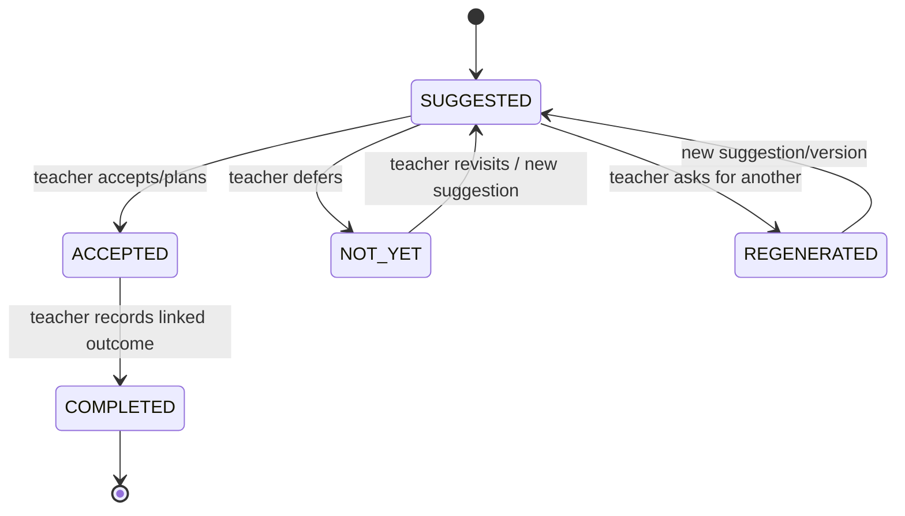
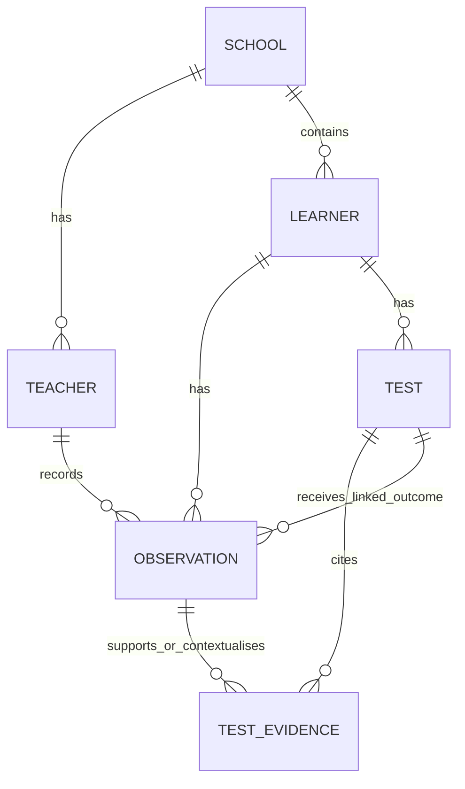

# Dira — Data Model

> **Status:** Logical MVP model. Align exact SQL/ORM types with the current `lib/db/schema.ts` and migrations before treating this as the implemented schema. The current architecture is authoritative: no pathway-note approval tables and no dedicated educational-source catalogue/content table in the MVP.

## 1. Data principles

- PostgreSQL is the system of record for learner evidence and workflow state.
- Observations are immutable source records wherever practical; corrections should be attributable and auditable rather than silently replacing the original.
- All records must be scoped to the relevant school/tenant and authorised teacher context if those concepts are implemented in the app.
- Every test suggestion cites actual observation IDs belonging to the same learner.
- A completed test requires a teacher-recorded outcome linked to the test.
- Evidence-card text is a derived view; it is not more authoritative than the underlying observations/tests/outcomes.
- Educational-source retrieval runs externally at suggestion time. A source catalogue/cache table is explicitly deferred.
- Use synthetic data in development/evaluation/demo environments.

## 2. Logical entities and fields

The fields below are recommendations for the logical data model. Names and nullable rules must be aligned to the implementation before migrations are written.

### 2.1 `schools` (if multi-school scoping is used)

| Field | Purpose |
|---|---|
| `school_id` | Primary key |
| `name` | School/institution display name where needed |
| `created_at` | Record creation time |

Do not collect more school/learner personal data than the workflow requires.

### 2.2 `teachers` / `users`

| Field | Purpose |
|---|---|
| `teacher_id` | Primary key from trusted authentication identity |
| `display_name` | Teacher name for attribution |
| `role` | Teacher/subject-teacher/class-teacher role as needed |
| `school_id` | School scope, if used |
| `created_at` | Record creation time |

The authenticated session determines who is saving an observation. Do not rely on a model-generated or client-only `teacher_id` to prove identity or permission.

### 2.3 `learners`

| Field | Purpose |
|---|---|
| `learner_id` | Stable primary key |
| `display_name` | Name or synthetic display name shown to authorised teachers |
| `class_id` / `class_label` | Class/grade context, if available |
| `school_id` | School/tenant scope, if used |
| `created_at` | Record creation time |
| `updated_at` | Last update time where applicable |

Do not store a fixed ability/pathway label. Any `profile_status` field should describe workflow state (for example, evidence recency or availability), not a judgement about the learner.

### 2.4 `observations`

| Field | Purpose |
|---|---|
| `observation_id` | Stable primary key |
| `learner_id` | Foreign key to the observed learner |
| `observer_id` | Foreign key to verified teacher/user |
| `observer_role` | Role at the time of the observation, where useful |
| `observation_type` | Controlled category such as academic, participation, behavioural, attendance, extracurricular, test result or other |
| `content_original` / `content` | Teacher's recorded wording; never silently replaced by model interpretation |
| `subject` / `context` | Lesson, subject or activity context when known |
| `term` | School term label if used |
| `observed_at` | When the described event happened, if known |
| `created_at` | When Dira stored the record |
| `capture_method` | `text`, `in_app_voice`, `basic_phone_callback`, or approved import |
| `submission_id` | Idempotency key to prevent duplicate saves on retry |
| `linked_test_id` | Nullable foreign key to `tests`; set for a teacher-recorded result of a suggested test |
| `recording_reference` | Optional authorised pointer/ID for audio; avoid broad retention by default |
| `transcript_text` | Optional transcript kept separate from original audio reference and original user-provided text |
| `transcription_provider` | Provider name where transcription was used |
| `transcription_status` | Optional processing/review state |
| `created_by_request_id` | Optional request/call ID for traceability |

`observed_at` and `created_at` mean different things and should not be conflated. The tool should not invent a time or observer if it is unknown.

### 2.5 `tests` / `suggested_tests`

| Field | Purpose |
|---|---|
| `test_id` | Stable primary key |
| `learner_id` | Foreign key to learner |
| `exploration_question` | Cautious question being explored, not a learner verdict |
| `reason` | Why a test is being suggested |
| `suggested_activity` | Concrete low-preparation activity |
| `purpose` | What the activity is designed to explore |
| `estimated_minutes` / `estimated_effort` | Approximate preparation/runtime |
| `what_to_observe` | Observable actions/events to look for |
| `what_to_log_after` | Follow-up instructions for teacher |
| `status` | `SUGGESTED`, `ACCEPTED`, `NOT_YET`, `REGENERATED`, `COMPLETED` |
| `created_by` / `requesting_teacher_id` | Teacher or workflow context that requested it, as appropriate |
| `created_at` | Time created |
| `accepted_at` | Nullable time teacher accepted/planned the test |
| `completed_at` | Nullable time outcome was recorded and the workflow was marked complete |
| `supersedes_test_id` | Nullable pointer to prior suggestion/version if regenerated |
| `retrieval_status` | Educational source retrieval status for this suggestion |
| `limitations` | Qualifying limitations as needed |

### 2.6 Test-to-evidence relationship

Each suggested test should retain a relation to the exact supporting observations. A join table such as `test_evidence` is appropriate if the implementation uses relational many-to-many structure:

| Field | Purpose |
|---|---|
| `test_id` | Foreign key to test |
| `observation_id` | Foreign key to the observation cited by the suggestion |
| `citation_role` | Optional: primary support, contradiction, or contextual record |

Alternatively, a JSON array of IDs can be used for a simple MVP only if every ID is still validated against PostgreSQL and relationships are reliably queried. Relational rows are easier to constrain and evaluate.

### 2.7 Test outcome

A separate `test_results` table is **not required** for the MVP if the outcome is stored as an observation with `linked_test_id`. That record must include the teacher, timestamp, context, original content and provenance. The test is complete only when the teacher-recorded linked outcome exists and the chosen state rule has passed.

A separate result table can be considered later if results need structured scoring or multiple outcomes, but do not duplicate facts across tables without a defined consistency rule.

### 2.8 Evidence Card / summary

The card may be computed on request from current underlying records. Persisting the final generated prose is optional and should not be required for correctness. If snapshots are saved for performance or history, store the relevant time range, generation time/version and references to source records; always be able to rebuild from underlying records.

The current MVP does not need a `pathway_notes`, `approvals`, or `guardian_deliveries` table to support the revised Evidence Card.

### 2.9 Operational logs

A minimal `agent_activity_logs`/equivalent record may contain:

- `run_id`, tool/action, timestamps, duration/latency, status and safe error code;
- model/provider identifier and token metrics when actually available;
- observation/test IDs involved, where safe;
- educational retrieval status and elapsed time;
- external MCP server/tool name and call status.

Do not store private chain-of-thought. Avoid logging unnecessary learner text, audio, tokens, or OAuth secrets.

## 3. State models

### Test lifecycle

The exact transition implementation may differ, but the invariant does not: acceptance is not completion. No automatic calendar event transition makes a test completed.

### Evidence interpretation

Use non-verdict labels for workflow state, such as `INSUFFICIENT_EVIDENCE`, `QUESTION_TO_EXPLORE`, `TEST_SUGGESTED`, `TEST_ACCEPTED`, `TEST_COMPLETED`, and `EVIDENCE_REASSESSED`. These describe the process, not the learner's identity or ability.

Do not recreate the old pathway-note state machine (`READY_FOR_REVIEW`, `APPROVED`, `SHARED_WITH_GUARDIAN`) for the current MVP.

## 4. Relationships

If the actual MVP is single-school, `SCHOOL` may be a future-ready logical concept rather than an immediately required table. Do not add complexity without an implementation need.

## 5. Data constraints and indexes

Recommended constraints/indexes to consider in the actual schema:

- Primary keys on all durable entities.
- Foreign keys: observation → learner/teacher; test → learner; evidence link → test/observation; linked outcome observation → test.
- Check constraints for allowed observation/test status enums.
- Unique constraint on the appropriate tenant plus `submission_id` for idempotent writes.
- Index observations by `(learner_id, observed_at)` or `(learner_id, created_at)` for timeline queries.
- Index tests by `(learner_id, status, created_at)`.
- Validate that observation, test and referenced learner IDs match the same learner at application level and, where practical, via database constraints/design.
- Restrict access to records by authenticated teacher/school scope.

## 6. Deferred educational-source persistence

External educational-source retrieval is required before each suggestion. **Do not add a dedicated educational-source catalogue/content table now.** The retriever may return transient source metadata and relevant excerpts for the current suggestion; keep genuine source URLs and retrieval status alongside the suggestion if needed for audit. A later enhancement may define a source table/cache for publisher/title, URL, dates, retriever timestamp, licence notes and content/excerpt pointers after the team revisits scope, retention, copyright and indexing needs.

## 7. Synthetic data expectations

Prepare deliberately varied and messy histories rather than perfect examples. The shared plan proposes roughly 10–15 synthetic learners and includes cases such as:

| Scenario | Example shape | Expected response |
|---|---|---|
| Very little evidence | One observation, one observer, no test | Do not claim a pattern; qualify or request more evidence |
| Repeated signal, one observer | Several observations from same teacher | Distinguish repetition from independent corroboration |
| Multiple observers | Similar observations from different teachers | May justify a question/test, but not a fixed trait |
| Suggested, not accepted | Test in `SUGGESTED` | Remains open |
| Accepted, no outcome | Test in `ACCEPTED` | Not complete; no test-result claim |
| Completed test | Linked outcome observation exists | Evidence loop can be reconstructed |
| Contradictory evidence | Supporting and conflicting records | Surface conflict and uncertainty |
| Longitudinal evidence | Multiple dates/terms and observers | Show timeframe; still avoid verdicts |
