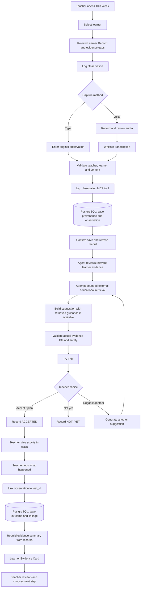
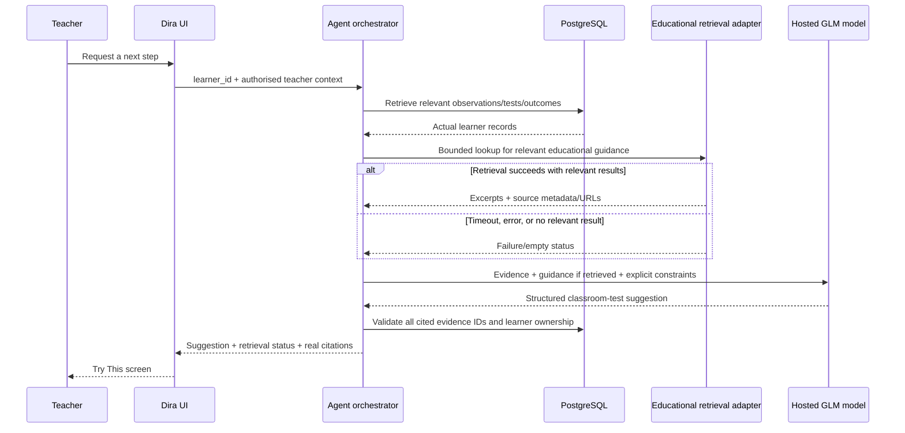
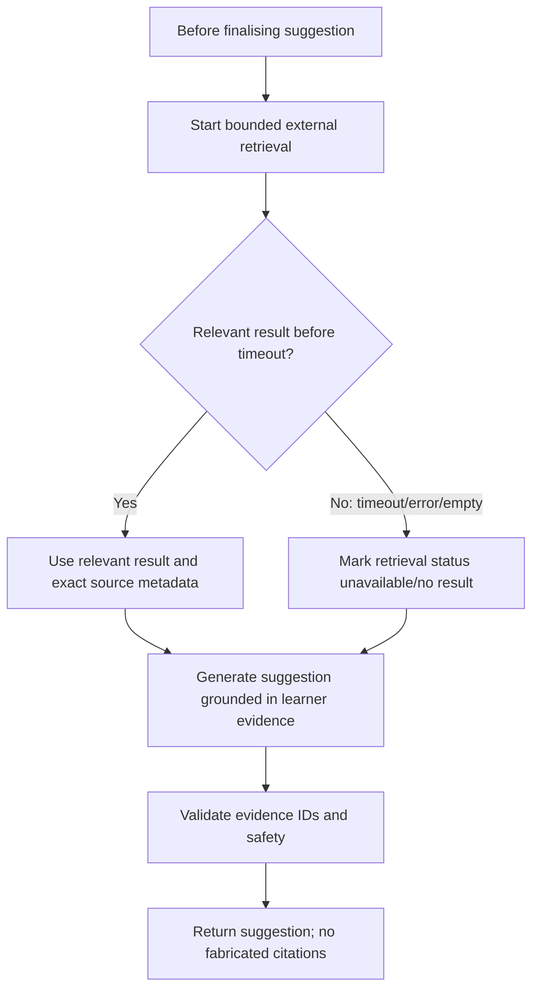

# Dira — User Flows

> **Current flow authority:** `ARCHITECTURE_Dira_Revised.md`. The shared planning PDF contains an older pathway-note/approval/guardian sequence. That sequence is superseded for this MVP. The current end state is a teacher-facing Learner Evidence Card and the teacher deciding what to explore next.

## 1. Main journey

## 2. Flow A — This Week to Learner Record

1. The teacher opens **This Week** and sees a small list of learners who have not been observed recently or whose records are relevant to the week's focus.
2. Rotation prioritises the least recently observed learners. It must not be random and must not imply low ability.
3. The teacher opens a learner's **Learner Record**.
4. The record shows observations and provenance, the open questions being explored, and any suggested/accepted/completed tests with their real states.
5. If the record contains too little evidence, say so plainly. Do not manufacture a pattern.

**Failure/empty states:** no learners available; no observations yet; records unavailable; stale/unavailable data. Each should say what is known and offer a safe next step, not invent data.

## 3. Flow B — Log Observation (typed)

1. Teacher enters the relevant learner's Log Observation screen from the Learner Record.
2. The unified, chat-style composer accepts a short natural-language observation. An observation category/context can be selected where the form requires it.
3. On submit, the server checks authorisation, selected learner, required fields, content length and idempotency key.
4. `log_observation` persists the original wording with observer, time, capture source, context and optional `linked_test_id`.
5. Only after persistence succeeds does the UI show a saved confirmation and refresh the timeline.

If validation fails, retain the draft and explain what needs correction. If the server times out after a write may have succeeded, use an idempotent retry/status check rather than blindly creating a second record.

## 4. Flow C — Log Observation (in-app voice)

1. Teacher records audio in the same bottom composer used for text, using the existing `VoiceNoteRecorder` rather than creating a duplicate recorder.
2. A recording preview lets the teacher review or discard it before submitting.
3. The backend sends audio to Whissle using the configured format and records the transcription status.
4. The transcript is checked for required context and material uncertainty. Unclear learner names, negation, key counts or facts require clarification before save.
5. The validated content follows the same `log_observation` and PostgreSQL path as typed input.
6. The UI confirms success only when the observation has been persisted.

An external transcription failure must produce an actionable error and no fabricated transcript. A separate planned basic-phone callback uses Africa's Talking Voice and should converge on this same observation pipeline once implemented.

## 5. Flow D — Suggest a classroom test

Mandatory behaviour:
- Attempt external guidance retrieval before returning a test suggestion; use a strict configurable timeout and cancellation when supported.
- If retrieval fails, continue with learner evidence and the model's available knowledge. Indicate the retrieval status accurately; do not add invented source citations.
- Keep educational guidance separate from evidence about this learner.
- Cite the exact observation IDs that led to the suggestion.
- Suggest a concrete, low-preparation activity, its purpose, duration/effort, what to observe, and what to log afterwards.

## 6. Flow E — Teacher action and test lifecycle

Allowed states in the current test lifecycle:

| State | Meaning | Valid next step |
|---|---|---|
| `SUGGESTED` | Dira has proposed an activity | `ACCEPTED`, `NOT_YET`, or `REGENERATED` |
| `ACCEPTED` | Teacher intends to try it | Remain accepted until a result is recorded, then `COMPLETED` |
| `NOT_YET` | Teacher is not trying it now | Revisit later; do not mark complete |
| `REGENERATED` | Teacher asked for another suggestion | Link to the new suggestion/version |
| `COMPLETED` | Teacher has recorded what happened | Include linked outcome in the Evidence Card |

Acceptance is not completion. Calendar events, reminders, and passage of time do not move a test to `COMPLETED`.

## 7. Flow F — Record test outcome

1. Teacher opens an accepted test and selects the action to record what happened.
2. Teacher enters the observation in text or voice.
3. The save path validates teacher/learner/test association and stores it using `log_observation` with `linked_test_id`.
4. Once the observation is persisted, the app updates the test lifecycle to completed (or derives completion from the linked saved outcome, depending on the implementation decision).
5. The evidence thread shows `question → suggestion/test → linked outcome`.

A test with no linked, teacher-recorded outcome remains open even if accepted.

## 8. Flow G — Learner Evidence Card

1. Request current summary data for the selected learner and time range.
2. Fetch the underlying observations, tests and outcomes directly from PostgreSQL.
3. Verify every record belongs to that learner and every relationship is valid.
4. Assemble questions explored, tests conducted, observed outcomes, supporting evidence, contradictions, open questions and limitations.
5. Validate that all claims are factual, appropriately scoped to the visible time range, and supported by record IDs.
6. Render the **Learner Evidence Card** for the teacher.

The card is not a pathway recommendation and has no required guardian delivery or pathway-note approval flow in the current MVP.

## 9. Flow H — Calendar-aware follow-up

Keeper.sh is the selected borrowed calendar MCP server. A scheduled job, provider event, or other explicit trigger—not a continuously running model—initiates the relevant workflow. Dira's MCP client connects to Keeper using the server's required transport/authentication and requests only the minimum schedule context needed.

Calendar information may tell Dira when a follow-up could be due. It does not confirm that a lesson actually happened, which learners were present, or what they did. Any resulting observation must be supplied and confirmed through the teacher capture flow.

## 10. External-retrieval fallback flow

No external source data needs to be saved to a dedicated PostgreSQL table for this flow. That table/library is deferred; external retrieval is not.

## 11. Flow exclusions and legacy routes

- No pathway-note approval queue, `APPROVED` learner-note state, guardian approval or guardian delivery in this MVP.
- Inspect existing `app/api/mcp/approve-note/route.ts` and any UI callers before removing or disabling it; do not leave a superseded route active accidentally.
- Inspect the existing `/dashboard` page and `/this-week` page before deciding whether one redirects or remains separate.
- The route `app/(teacher)/learners/[learnerId]/log-observation/page.tsx` is proposed by the architecture unless already present; check the repository before adding it.
